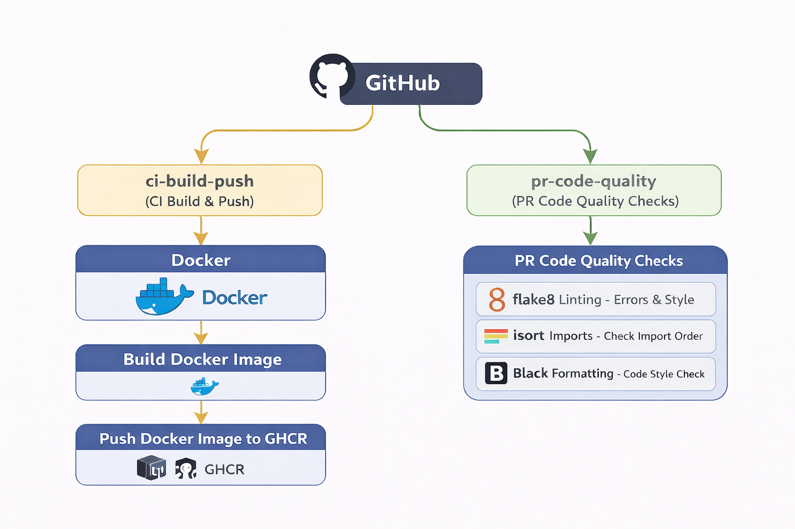

# simple-app-container

1. This python app is build as a simple showcase how to use docker, dockercompose, python, json, and simple endpoints. 
2. To run the app please follow instructions:
- build the app using  ``docker build -t simple-app .``
    - run the docker container ``docker run -p 8080:8080 simple-app``
    - use docker compose file ``docker-compose up --build``

After running steps succesffuly, application should expose two endpoints:
1. /health-check - nothing special, just json with OK status
2. /hello-world - some simple text, which can overwritten by setting env example: ``docker run -p 8080:8080 -e SERVER_HELLO="Hello from ENV overwrite" simple-app``

Additionally, this repository contains two workflows showcase for CI/CD purposes.

